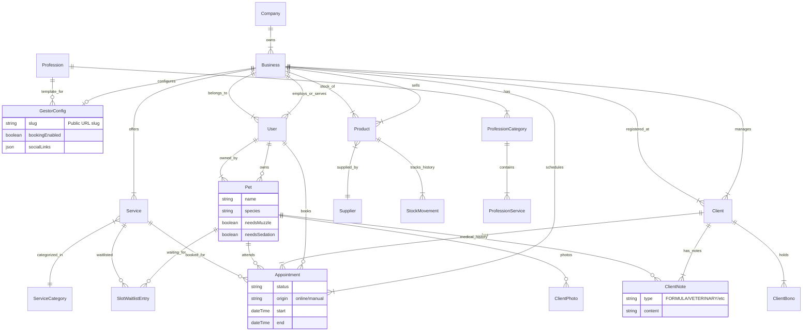

# Database Schema Diagram

This diagram represents the current structure of the `gest-tools` database, including the recently added **Pets**, **Inventory**, and **Profession Templates** modules.

## Key Relationships
- **Multi-tenancy**: `Business` is the central entity. Almost everything (`Service`, `Product`, `Client`) belongs to a `Business`.
- **Hybrid Users**: `User` can be a `gestor` (manager) or `client` (end-user). `Client` entity is also used specifically for the CRM profile.
- **Pets**: Linked to `User` (Owner) but integrated into `Appointment` and `ClientNote` for veterinary flows.
- **Inventory**: `StockMovement` tracks all changes (audit log) for `Product`.
